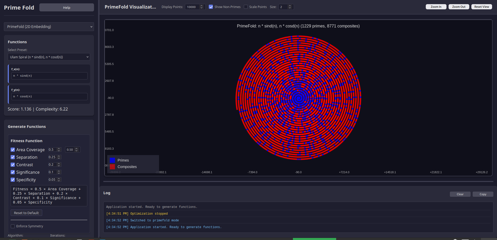
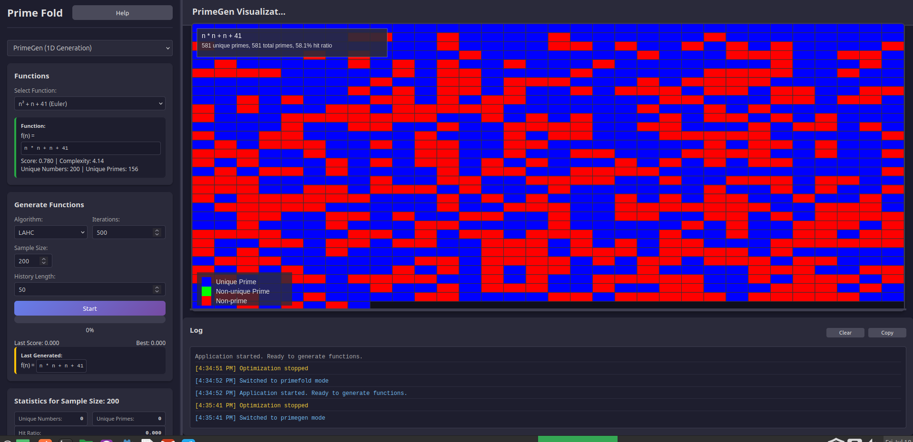

# Prime Fold

A JavaScript web application for discovering mathematical functions that generate or embed prime numbers using evolutionary algorithms and advanced fitness functions.

## Screenshots

**PrimeFold Mode (2D Embedding):**



**PrimeGen Mode (1D Generation):**



## Features

### PrimeFold Mode (2D Embedding)
- Finds functions f(n) and g(n) that map prime numbers to well-distributed 2D points
- Visualizes both prime and composite numbers on a scatter plot
- Shows convex hull and distribution metrics
- Real-time scoring with area coverage, separation, contrast, significance, and specificity metrics
- Configurable fitness function with individual metric weights and thresholds

### PrimeGen Mode (1D Generation)
- Finds function f(n) that generates many unique prime numbers
- Hit map visualization showing prime vs non-prime generated numbers
- Real-time scoring based on hit ratio (unique primes / total range)

### Optimization Algorithms
- **LAHC (Late Acceptance Hill Climbing)**: Fast and effective for most cases
- **GA (Genetic Algorithm)**: Good for complex function discovery
- **SA (Simulated Annealing)**: Good exploration of solution space

## Getting Started

1. Clone the repository
2. Open `index.html` in your browser to use the app
3. See `docs/README.md` and other files in `docs/` for detailed documentation, metrics, and implementation notes
4. To run or view tests, open any of the HTML files in the `tests/` directory in your browser

## File Structure

```
js-fold/
├── index.html              # Main HTML file
├── css/
│   └── style.css          # Stylesheet
├── js/
│   ├── main.js            # Main application
│   ├── core/
│   │   ├── tree.js        # Expression tree system
│   │   ├── compile.js     # Expression compilation
│   │   ├── evaluators.js  # Scoring functions
│   │   ├── optimizers.js  # Optimization algorithms
│   │   └── prime-cache.js # Prime number caching
│   └── gui/
│       └── canvas.js      # Visualization system
├── docs/                  # Documentation files
```

## Technical Details

- **Expression Trees**: Mathematical expressions are represented as trees for easy manipulation
- **Safe Evaluation**: All expressions are compiled safely to prevent code injection
- **Responsive Optimization**: Optimization runs on the main thread, using throttling (setTimeout/setInterval) to keep the UI responsive. (Note: Web Workers are not currently used.)
- **Real-time Updates**: Progress, scores, and visualizations update in real-time
- **Export Functionality**: Save discovered functions as text files
- **Deduplication**: Automatic rejection of duplicate functions during optimization

It's a static page, can be run locally from index.html.

## Help

### Using Prime Fold

Prime Fold lets you explore mathematical functions that generate or embed prime numbers. You can use two main modes:

- **PrimeFold Mode (2D Embedding):** Enter or evolve two functions, `f_x(n)` and `f_y(n)`, to map numbers to 2D points. Primes and composites are visualized differently. You can manually enter expressions in the input box, e.g.:
  - `f_x(n) = n, f_y(n) = n^2`
  - Or simply: `n, n^2`

- **PrimeGen Mode (1D Generation):** Enter or evolve a single function, `f(n)`, to generate numbers. The app visualizes which outputs are prime. Example:
  - `f(n) = 2*n + 1`

You can edit the expressions at any time to try your own formulas. The app will parse and visualize them immediately.

#### Expression Syntax

Expressions support a variety of mathematical functions and operators. See [`docs/expressions.md`](docs/expressions.md) for a full list of supported functions, operators, and syntax tips.

If you enter an invalid expression, an error will be shown in the console and the visualization will not update.

For more details on metrics, optimization, and implementation, see the `docs/` folder.

## License

This project is licensed under the MIT License.
